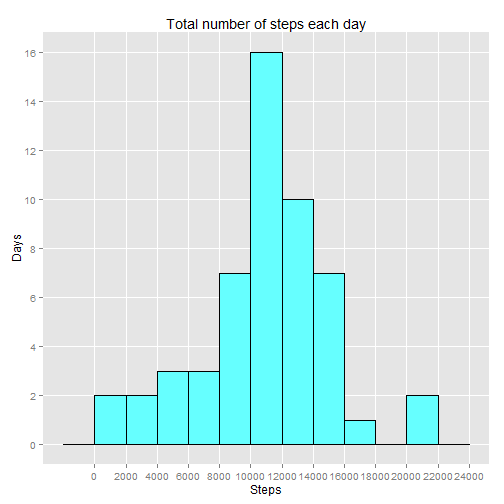
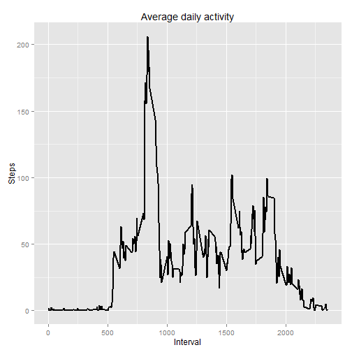
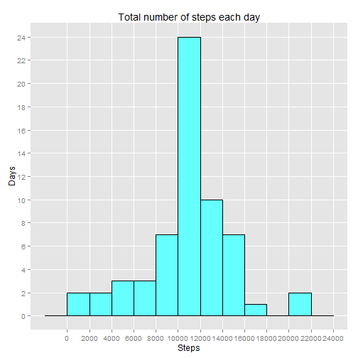
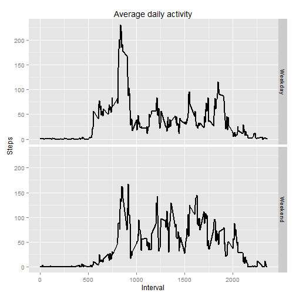

###Loading and preprocessing data
The first step of this assigment is to load data. So be sure that there are unziped file with data ("activity.csv") in your working directory.

```r
setwd("e:/coursera/Reproduc research") #setting work directory
fl <- read.csv ("./activity.csv", na.string = "NA")
str(fl) #Look briefly on data
```

```
## 'data.frame':	17568 obs. of  3 variables:
##  $ steps   : int  NA NA NA NA NA NA NA NA NA NA ...
##  $ date    : Factor w/ 61 levels "2012-10-01","2012-10-02",..: 1 1 1 1 1 1 1 1 1 1 ...
##  $ interval: int  0 5 10 15 20 25 30 35 40 45 ...
```
So there are 17 568 observations and 3 variable. **steps** and **interval** has an integer type and **date** is as factor.  
Let converts variable **date** into Date-format for convinience

```r
fl$date <- as.Date (fl$date)
```

###What is mean total number of steps taken per day?

Now it should be obtain the total number of steps per day. For this I will use *plyr* package. But at first exclude NA values.


```r
good <- complete.cases (fl)
fl_g <- fl[good,] #variable fl_g is without NA values

library(plyr)
StepsPerDay <- ddply (fl_g, .(date), summarise, steps_pd = sum(steps))
```

So we can make a histogram of the total number of steps taken each day. I will use **ggplot2** graphic system. 


```r
library (ggplot2)
ggplot(StepsPerDay, aes(steps_pd)) +
        geom_histogram (binwidth = 2000, fill = "#66FFFF", colour = "black") +
        labs(title = "Total number of steps each day", x = "Steps", y = "Days") +
        scale_x_continuous (breaks = seq(0, 24000, 2000), minor_breaks = NULL) +
        scale_y_continuous (breaks = seq(0, 16, 2), minor_breaks = NULL)
```

 

Empty space on the histogram means that there were no days with the number of steps in a given interval or we have no data.  
 
Now I'm going to calculate **mean** and **median** of the total number of the steps per day. 

```r
mean_withoutNA <- ceiling(mean (StepsPerDay$steps_pd))
median_withoutNA <- median (StepsPerDay$steps_pd)
```
So **mean** is 10767 and **median** is 10765.

###What is the average daily activity pattern?
Let it obtain the average daily activity and make a time series plot.


```r
DailyActivity <- ddply (fl_g, .(interval), summarise, steps_pi = mean(steps))

ggplot(DailyActivity, aes(interval, steps_pi)) +
        geom_line (size = 1) + labs(title = "Average daily activity", x = "Interval", y = "Steps")
```

 

Now I am going to obtain 5-minute interval in which average number of steps is maximum.


```r
max_i <- DailyActivity [DailyActivity$steps_pi == max(DailyActivity$steps_pi), "interval"]
```

So the 5-minute interval which contains the maximum number of steps is **835**

###Inputing missing values

Now I'm going to obtain number of missing values:

```r
sum (!good) #variable good contain number of complete cases in variable with data
```

```
## [1] 2304
```

I've decided use mean for 5-minute interval with NA values. Now I'm going to create a new data set with filled missing NA


```r
fl_n <- fl #creating new data frame
for (i in 1:length (fl_n$steps)){
        if (is.na(fl_n[i, "steps"])) {
                gd <- fl_n[i,"interval"] == DailyActivity$interval
                fl_n[i,"steps"] <- ceiling(DailyActivity[gd, "steps_pi"])
                }
}
```

Now I'm going to make a histogram of a new variable without NA

```r
StepsPerDay_n <- ddply (fl_n, .(date), summarise, steps_pd = sum(steps))

ggplot(StepsPerDay_n, aes(steps_pd)) +
        geom_histogram (binwidth = 2000, fill = "#66FFFF", colour = "black") +
        labs(title = "Total number of steps each day", x = "Steps", y = "Days") +
        scale_x_continuous (breaks = seq(0, 24000, 2000), minor_breaks = NULL) +
        scale_y_continuous (breaks = seq(0, 26, 2), minor_breaks = NULL)
```

 

As wew can see number of days in the interval 10000-12000 steps increased as compared with previous histogram.  
Now I'm going to calculate **NEW** **mean** and **median** of the total number of the steps per day and compare they with previous. 

```r
mean_filledNA <- ceiling(mean (StepsPerDay_n$steps_pd))
median_filledNA <- median (StepsPerDay_n$steps_pd)
```

So NEW **mean** is 10785 and is PREVIOUS (where NA omit) 10767. So adding filled NA values slightly increases **mean**.  
NEW **median** is 10909 and is PREVIOUS (where NA omit) 10765. So adding filled NA values increases **median**.  

###Are there differences in activity patterns between weekdays and weekends?
Now I'm going to create a new factor variable with 2 levels Weekend & weekday


```r
fl_n$weekdays <- weekdays(fl_n$date)
we <- fl_n$weekdays %in% c("Sunday", "Saturday")
fl_n$weekdays[we] <- "Weekend"
fl_n$weekdays[!we] <- "Weekday"
fl_n$weekdays <- factor(fl_n$weekdays)
```

Now I'm going to calculate 5-minute interval and the average number of steps taken, averaged across all weekday days or weekend. And then plot it


```r
DailyActivity_w <- ddply (fl_n, .(interval, weekdays), summarise, steps_pi = mean(steps))

ggplot(DailyActivity_w, aes(interval, steps_pi)) + 
        geom_line (size = 1) + labs(title = "Average daily activity", x = "Interval", y = "Steps") +
        facet_grid(weekdays~.)
```

 

As we can see there are differences in activity patterns between weekdays and weekends
